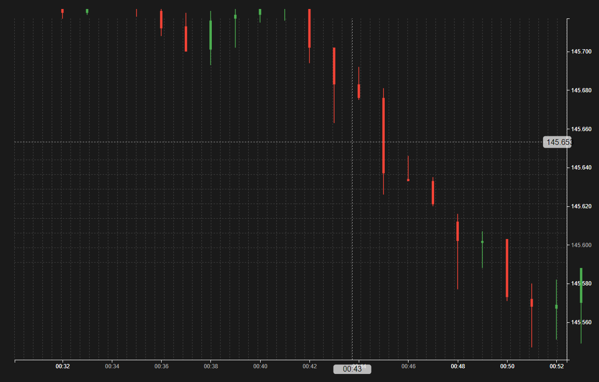

# TradeVision AI

TradeVision AI is a powerful web application that integrates TradingView and D3.js charting libraries to offer a robust financial charting tool. The app provides users with an interactive experience where they can analyze financial data using both TradingView's advanced charts and custom D3.js charts.

## Features

- **Dual Charting:** Seamlessly toggle between TradingView and custom D3.js charts.
- **Crosshair Tool:** Integrated crosshair tool with dotted lines for precise tracking of chart data.
- **Right-Click Menu:** Customizable right-click menu with options for advanced analysis (e.g., Test Theory, S/R, Patterns, Study).
- **Market Data Display:** Real-time display of market data alongside charts.
- **Responsive Design:** Fully responsive layout that adjusts to various screen sizes.

## Current Structure

- **TradingView Chart:** Displays real-time data with advanced charting features.
- **D3.js Chart:** Custom chart built with D3.js that mimics the appearance and functionality of TradingView charts.
- **Sidebar Panels:** Panels to toggle between TradingView and D3.js charts, as well as display spread information.
- **Data Container:** A section for displaying additional market data or analysis results.

## Folder Structure

- `templates/index.html` - The main HTML file containing the structure of the web app.
- `static/d3chart.js` - JavaScript logic for rendering the D3.js chart.
- `static/d3chart.css` - Styling specific to the D3.js chart.
- `static/tradingview.js` - JavaScript logic for integrating the TradingView chart.
- `static/styles.css` - Global styles for the app, including layouts and common elements.

## Setup Instructions

1. **Clone the Repository:**
   ```bash
   git clone <your-repository-url>
   cd TradeVisionAI
   ```

2. **Install Dependencies:**
   Ensure that you have Python and Flask installed to run the application.

3. **Run the App:**
   ```bash
   flask run
   ```
   The app will be available at `http://127.0.0.1:5000/`.

## Screenshots

### TradingView Chart


### D3.js Chart


## Technology Stack

- **Frontend:**
  - HTML5
  - CSS3
  - JavaScript (D3.js, TradingView)
- **Backend:**
  - Python (Flask)

## Future Enhancements

- **Chart Navigation:** Implement scroll zoom and drag-pan functionalities for better chart navigation.
- **Custom Indicators:** Add support for custom indicators and overlays on the D3.js chart.
- **User Authentication:** Secure user login to save chart preferences and settings.

## Contributing

We welcome contributions from the community! Please fork this repository, make your changes, and submit a pull request.

## License

This project is licensed under the MIT License. See the [LICENSE](LICENSE) file for more details.

---

### Icons and Graphs

```plaintext
⬇️ TradingView Chart
⬇️ D3.js Chart
📊 Market Data Display
```
